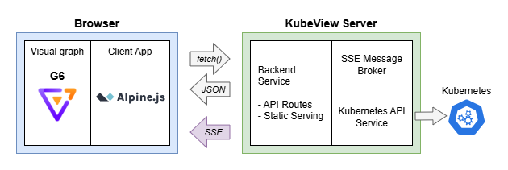

# KubeView

KubeView is a Kubernetes cluster visualization tool that provides a graphical representation of your cluster's resources and their relationships. It helps you understand the structure and dependencies of your Kubernetes resources, making it easier to manage and troubleshoot your cluster. It is designed to be lightweight, easy to use, and provides a real-time view of your cluster's resources.

Note: This is a v2 and complete rewrite the original KubeView project [see below](#-why-a-v2-rewrite) for some insight on the differences and why this was created.

[](https://github.com/benc-uk/kubeview/actions/workflows/ci.yaml)

[](https://github.com/benc-uk/kubeview/issues)
[](https://github.com/benc-uk/kubeview/pulls)
[](https://github.com/benc-uk/kubeview/releases)

## 📜 Details


### Features

- Provides a secure read-only view of resources in a graph, with resources as nodes, linked with derived relationships
- Real-time updates using Server-Sent Events (SSE) so view dynamically updates as resources change
- Supports a wide range of common and core Kubernetes resource types, including Pods, Deployments, Services, ConfigMaps, Secrets, Ingresses, and more
- Colour coding (Red/Green/Grey) of resources based on their status and health
- Side info panel allows you to view further details of resources, including labels, annotations, and other properties
- Display list of events which have occurred in the namespace
- Drill down and show pod logs for debugging and troubleshooting
- Filtering of resources by type to reduce clutter
- Search functionality to quickly find & filter resources by name

## 🏗️ Architecture & Design

KubeView is built using Go for the backend, exposing a REST API that provides the data for the frontend, and serves static HTML/JS. The frontend is a static web application that uses HTML, CSS, and plain modern JavaScript (ES6) to render the user interface. It uses [G6](https://g6.antv.antgroup.com/en) for graph visualization, [Alpine.js](https://alpinejs.dev/) for client-side interactivity, and [Bulma](https://bulma.io/) for styling.

The backend uses the Go client for Kubernetes to retrieve resource information, including setting up watchers for real-time updates streamed using SSE. The data is then processed and sent to the frontend as JSON, which the frontend uses to render the graph and update the UI.



A `clientID` is used to identify the client and send updates for the resources they are interested in. The frontend JS generates a unique `clientID` when it first starts, stores it in local storage, and uses it in all subsequent requests to the backend. This allows the backend to send real-time updates only to the clients that are interested in those resources.

### Routes & Endpoints

- `/api/namespaces`: Returns a list of namespaces in the cluster.
- `/api/fetch/{namespace}?clientID={clientID}`: Returns a list of resources in the cluster for the specified namespace.
- `/api/logs/{namespace}/{podname}`: Fetches logs for a specific pod in the specified namespace.
- `/api/status`: Returns the status of the KubeView server, including the version and build information.
- `/updates?clientID={clientID}`: Establishes a Server-Sent Events (SSE) connection for real-time updates.
- `/health`: Simple health endpoint to check if the server is running.
- `/public/*`: Serves static files such as HTML, CSS, JavaScript, and images used by the frontend application.
- `/`: Serves the main HTML page (index.html) that loads the KubeView application.

## 🔐 Security and Kubernetes API Authentication

The KubeView backend connects to the Kubernetes API via two methods, depending on where it is running:

- **Outside a Kubernetes cluster:** On startup it locates the users local Kubernetes configuration file (usually located at `$HOME/.kube/config`) to authenticate and access the cluster. This is suitable for local development or when running KubeView on a machine that has access to a Kubernetes cluster.
- **Inside a Kubernetes cluster:** When running inside a Kubernetes cluster, KubeView uses a service account associated with the pod to authenticate and access the cluster. This service account should be assigned a role that grants it read-only access to the resources you want to visualize. This is the recommended way to run KubeView, and the Helm chart provides a service account, role & role-binding that can be used to set this up easily.

The application itself does not enforce any authentication or authorization, it relies on the Kubernetes API server to handle access control. This means that the permissions granted to the service account or user in the Kubernetes cluster will determine what resources KubeView can access and display.

## 🚀 Running Locally & Quick Start

Pre-reqs:

- Docker or other container runtime like Podman.
- A Kubernetes cluster to connect to (can be local or remote)
- A valid Kubernetes configuration file, if you using kubectl, chances are you already have this set up.

Running it via Podman or Docker is the easiest way to get started. You can quickly run KubeView locally with the following command:

```bash
docker run --rm -it --volume "$HOME/.kube:/root/.kube" \
 -p 8000:8000 ghcr.io/benc-uk/kubeview:latest
```

This mounts your local Kubernetes configuration directory `$HOME/.kube` into the container, allowing KubeView to access your cluster. The app will be accessible at `http://localhost:8000`. If your config file is located elsewhere, you'll need to adjust the volume mount accordingly.

### Configuration

The following environment variables are supported:

- `PORT`: The port on which the KubeView server will listen. Default is `8000`.
- `SINGLE_NAMESPACE`: If set, KubeView will only show resources in the specified namespace
- `NAMESPACE_FILTER`: A regex pattern to filter namespaces. If set, namespaces that match the pattern will be _excluded_ e.g. `NAMESPACE_FILTER=^kube-` will not show system namespaces starting with `kube-`.
- `DISABLE_POD_LOGS`: If set to `true` or `1`, pod logs will not be available via the API, or to view in the UI. This is useful for environments where you do not want to expose pod logs to users. Default is `false`.

In addition the standard `KUBE_CONFIG` environment variable can be used to specify a custom path to the Kubernetes configuration file. If not set, it defaults to `$HOME/.kube/config`.

## ❇️ Deploying to Kubernetes

Use the [provided Helm chart](deploy/helm/readme.md) and [GitHub published images](https://github.com/benc-uk?tab=packages&repo_name=kubeview) to deploy KubeView to your Kubernetes cluster. The chart is designed to be simple and easy to use, with a range of configuration options.

## 🧑‍💻 Developer Guide

If you wish to contribute to this project, or make code changes, it is suggested to use the dev container provided in the repo. This will ensure you have all the dependencies installed and configured correctly.

### The .dev folder

The `.dev` directory is an new attempt to reduce the number of files in the root directory. It contains configuration files for various development tools, air, golangci-lint, eslint, prettier, and more. This is to keep the root directory clean and focused on the main application code. The use of a separate `tools.mod` file keeps Go tool dependencies separate from the main `go.mod` file, which is a good practice for managing development dependencies.

The makefile provides a number of commands to help you get started:

```text
help                 💬 This help message :)
lint                 🔍 Lint & format check only, use for CI
lint-fix             ✨ Lint & try to format & fix
run                  🏃 Run application, used for local development
build                🔨 Build application binary
clean                🧹 Clean up and reset
image                📦 Build container image from Dockerfile
helm-docs            📜 Update docs & readme for Helm chart
helm-package         🔠 Package Helm chart and update index
```

### Project Structure

The project is structured as follows:

```text
📂
 ├── deploy           # Dockerfile and Helm chart
 ├── docs
 ├── public           # Static files served by the web server
 │   ├── css          # Stylesheets
 │   ├── ext          # External libraries (G6, Alpine.js etc.)
 │   ├── img          # Images and icons
 │   ├── js           # All client side JavaScript, see main.js for entry point
 │   └── fragments    # HTML fragments for Alpine.js components
 └── server           # Core backend API server
     └── services     # Services for handling Kubernetes resources and SSE
```

## 🤓 Why a v2 Rewrite?

The goal of this rewrite was to create a more maintainable codebase from the original KubeView. Some choices that have been made in this rewrite include:

- Removal of Vue.js, and no bundling or NPM required.
- Switch from Cytoscape.js to G6 for graph visualization, as it is (mostly) easier to work with and has more modern features.
- Using SSE (Server-Sent Events) for real-time updates instead of polling.
- Use of [Alpine.js](https://alpinejs.dev/) for managing client side behaviour.
- Switch to [Bulma](https://bulma.io/) for CSS and themes.
- Clean up & refactor messy parsing logic for resources and their relationships (but it's still pretty messy!).

The rewrite originally used HTMX for fetching data and HTML fragments from the server. This worked but ended up unnecessarily complicated with so many interactions between the frontend and backend. The resulting code was also hard to follow and understand. As a result the current rewrite is more of an iteration of v1, the Vue.js code has been removed and replaced with a simpler static HTML/JS app that uses Alpine.js for interactivity. The backend API has been clear separation of concerns and now dynamically handles updates using SSE.

## Appendix A: Kubernetes Permissions

If you are not using the provided Helm chart, you will need to ensure that the service account or user that KubeView uses to connect to the Kubernetes API has the necessary API permissions.

For reference these permissions are `get`, `list`, `watch` for all of the following resources:

- v1/pods
- v1/namespaces
- v1/services
- v1/configmaps
- v1/secrets
- v1/endpoints
- v1/events
- v1/persistentvolumesclaims
- apps/v1/deployments
- apps/v1/replicasets
- apps/v1/statefulsets
- apps/v1/daemonsets
- networking.k8s.io/v1/ingresses
- batch/v1/jobs
- batch/v1/cronjobs
- discovery.k8s.io/v1/endpointslices
- autoscaling/v2/horizontalpodautoscalers
